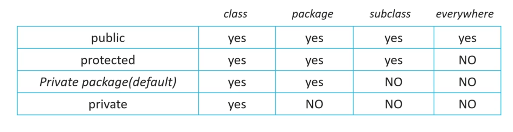
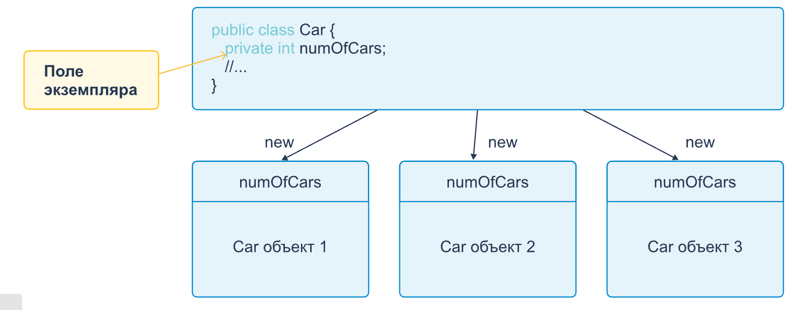
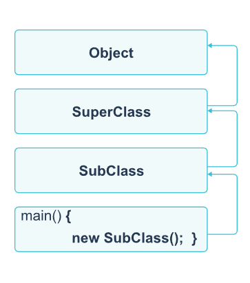
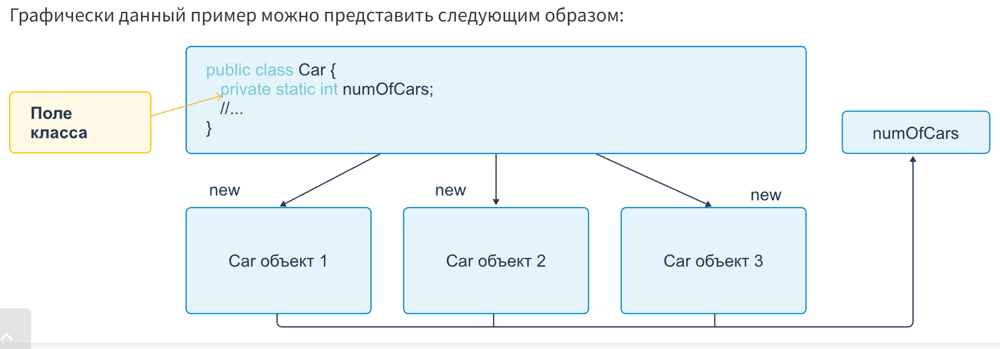

[Automatic line wrapping in Jetbrains ide ](https://blog.cpming.top/p/automate-breaking-lines-in-jetbrains)

[Array](https://elearn.epam.com/courses/course-v1:RD_CIS+JB+0222/courseware/03afc15b262c4eafa6d39f670decf1ee/6552d820e596477a81304fa026cb75b7/5?activate_block_id=block-v1%3ARD_CIS%2BJB%2B0222%2Btype%40vertical%2Bblock%4022425677894e412ba1c041e0aa07b1a7)

[имена переменных можно поменять так же. Стал на имя, просто жмешь Shift+F6 и все – можешь вводить новое имя, и везде, где используется эта переменная, оно поменяется.](https://ru.stackoverflow.com/questions/1348467/%D0%9F%D0%BE%D0%B4%D1%81%D0%BA%D0%B0%D0%B6%D0%B8%D1%82%D0%B5-%D0%BA%D0%B0%D0%BA-pycharm-%D0%B8%D0%B7%D0%BC%D0%B5%D0%BD%D0%B8%D1%82%D1%8C-%D0%B8%D0%BC%D1%8F-%D0%BF%D0%B5%D1%80%D0%B5%D0%BC%D0%B5%D0%BD%D0%BE%D0%B9-%D1%81%D1%80%D0%B0%D0%B7%D1%83-%D0%B2-%D0%BD%D0%B5%D1%81%D0%BA%D0%BE%D0%BB%D1%8C%D0%BA%D0%B8%D1%85-%D0%BC%D0%B5%D1%81%D1%82%D0%B0%D1%85)

[Поиск максимального/минимального значения в массиве примитивов с использованием Java](https://stackoverflow.com/questions/1484347/finding-the-max-min-value-in-an-array-of-primitives-using-java)

[ssh to gitLub](https://www.youtube.com/watch?v=_Yod5uX-GqY)

[java в примерах](http://uchcom7.botik.ru/L/prog/java/java_v_primerakh.pdf)

[]

